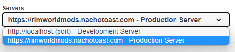

# Contributing <!-- omit in toc -->

## Table of Contents <!-- omit in toc -->

- [Installation Guide](#installation-guide)
- [Script Reference](#script-reference)
- [Dependency Reference](#dependency-reference)
- [Production Build](#production-build)
- [FAQ](#faq)

### Installation Guide

See the [installation guide](./InstallationGuide.md).

### Script Reference

-   `start` Starts the app with hot-reloading enabled.
-   `build` Compiles app source code into JavaScript.
-   `lint` Makes sure code follows style rules.
-   `typecheck` Makes sure there are no type errors in the code.
-   `test` Runs tests using Jest.
-   `check-all` Does linting, typechecking, and testing. Note that this requires pnpm.

### Dependency Reference

- `axios` Makes HTTP requests to Steam web pages.
- `cors` Client origin whitelisting.
- `express` Provides a web server.
- `express-openapi-validator` Validates API requests and responses against an OpenAPI schema.
- `express-rate-limit` Limits the number of requests a client can make to the server.
- `mongodb` Stores mod data.
- `node-cron` Helps with sheduling (routinely updating mod data).
- `node-html-parser` Parses data from HTML responses.
- `swagger-ui-express` Provides a UI for viewing the OpenAPI schema (`/api-docs`).

### Production Build

Remember to set the `NODE_ENV` environment variable to `production` if you want to start the API in production mode.

```sh
# Linux & Mac
export NODE_ENV=production

# Windows
$env:NODE_ENV = 'production'
```

### FAQ

Trying out any operation in the [api doc](https://rimworldmods.nachotoast.com/api-docs/) returns "Failed to fetch", how do I fix this?

> Make sure your server (at the top of the page) is set to `rimworldmods.nachotoast.com`, since by default it looks for your development server which might not be running.
>
> 
