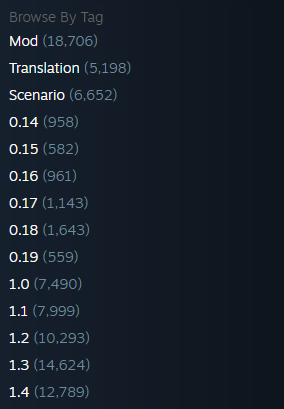

# RimWorld Mod Catalogue

The RimWorld Mod Catalogue is a fullstack application aimed to provide a better mod browsing experience for RimWorld players.

### Why was this made?

The Steam workshop tags for RimWorld mods are limited. Despite the large variety of mods out there they aren't categorized by their functionality at all.

The RimWorld Mod Catalogue aims to solve this problem by adding tags to mods based on keywords in their description, and then allowing users to search for mods using any combination of these tags.

### How does it work?

The RimWorld Mod Catalogue is made up of two parts: the server and the client.

- The **server** routinely fetches, tags, and stores mods in a database.
- The **client** is a website that users can use to search for mods, it makes requests to the server.

For more detail information about each part, see their respective folders.

- [Server](./server/README.md)
- [Client](./client/README.md)

### Limitations

- The RimWorld Mod Catalogue is not a replacement for the Steam workshop. It does not allow users to download, comment, or otherwise interact with mods.
- Updates to mods on the Steam workshop are not reflected in the RimWorld Mod Catalogue until the server updates them. This is done on a schedule, so there may be a delay between when a mod is updated on the Steam workshop and when it is updated on the RimWorld Mod Catalogue.
  - Updates to the code of a mod will normally be shown within **1 day**.
  - Updates to other aspects of a mod (description, thumbnail, etc.) should normally be shown within **1 week** (this includes deletions).
- Tagging is done using the keywords in a mods description, so it will not be 100% perfect.
  - There are plans to use machine learning or AI to improve the tagging process in the future.
- Only mods that are publically available on the Steam workshop are included in the catalogue.
- Only **1.4** mods are included in the catalogue.

### Contributing

Contributions are always welcome, check out [CONTRIBUTING.md](./.github/CONTRIBUTING.md) to get started.

### Licensing

The RimWorld Mod Catalogue is licensed under the [MIT License](./LICENSE).
