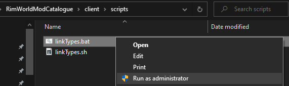

# Installation Guide <!-- omit in toc -->

## 0. Install Main Dependencies

You will need to manually install the following things on your system and add them to your path:

-   [Node JS](https://nodejs.org/) v16 or higher. Non-LTS and versions below 16 will probably work, but haven't been tested.
    - Test this by running `node -v` in a terminal.
-   [pnpm](https://pnpm.io/), recommended but npm and yarn should still work fine.
    -   If you've properly installed Node JS, you should be able to install pnpm by simply running `npm i -g pnpm` in a terminal.

## 1. Setup Repository & Dependencies

Now you can set up the repository from a terminal:

```sh
git clone https://github.com/NachoToast/RimWorldModCatalogue.git RimWorldModCatalogue
cd RimWorldCatalogue/client
pnpm install
```

## 2. Create Symlinks

The [client types folder](../src/types/) needs to be linked to the [server shared types folder](../../server/src/types/shared/):

For **Windows**, you will need to run the [linkTypes.bat](../scripts/linkTypes.bat) script as an administrator.

> 

For **MacOS**, **Linux**, and other UNIX-like operating systems, you need to run the [linkTypes.sh](../scripts/linkTypes.sh) script.

> ```sh
> chmod +x scripts/linkTypes.sh
> ./scripts/linkTypes.sh
> ```

## 3. Start the Client

Now you can start the client (and other scripts) using `pnpm start` (or `npm start`).

<sup>[1]</sup>Yes I know Linux is "unix-like" and not "unix", not relevant here.