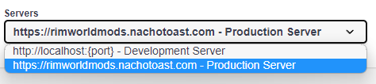

# RimWorld Mod Catalogue / Server <!-- omit in toc -->

[](https://github.com/NachoToast/RimWorldModCatalogue/actions/workflows/node.js.ci.server.yml)
[](https://github.com/NachoToast/RimWorldModCatalogue/actions/workflows/deploy.server.yml)
[](https://github.com/NachoToast/RimWorldModCatalogue/actions/workflows/codeql-analysis.yml)

The server for the RimWorld Mod Catalogue handles fetching and updating mod data from the Steam workshop, and provides an API for the client to use to query mod data.

The live production server can be found at [https://rimworldmods.nachotoast.com](https://rimworldmods.nachotoast.com).

## Table of Contents <!-- omit in toc -->

- [Technologies](#technologies)
- [Installation](#installation)
- [Documentation](#documentation)
  - [Script Reference](#script-reference)
  - [Dependency Reference](#dependency-reference)
  - [Production Build](#production-build)
- [FAQ](#faq)

### Technologies

<div style="display: flex">

  <a href="https://nodejs.org/">
  
  </a>

  <a href="https://www.typescriptlang.org/">
  
  </a>

  <a href="https://expressjs.com/">
  
  </a>

  <a href="https://www.mongodb.com/">
  
  </a>

  <a href="https://jestjs.io/">
  
  </a>

</div>

### Installation

See the [installation guide](./docs/InstallationGuide.md).

### Documentation

#### Script Reference

-   `start` Starts the server with hot-reloading enabled.
-   `build` Compiles server source code into JavaScript.
-   `lint` Makes sure code follows style rules.
-   `typecheck` Makes sure there are no type errors in the code.
-   `test` Runs tests using Jest.
-   `check-all` Does linting, typechecking, and testing. Note that this requires pnpm.

#### Dependency Reference

- `axios` Makes HTTP requests to Steam web pages.
- `cors` Client origin whitelisting.
- `express` Provides a web server.
- `express-openapi-validator` Validates API requests and responses against an OpenAPI schema.
- `express-rate-limit` Limits the number of requests a client can make to the server.
- `mongodb` Stores mod data.
- `node-cron` Helps with sheduling (routinely updating mod data).
- `node-html-parser` Parses data from HTML responses.
- `swagger-ui-express` Provides a UI for viewing the OpenAPI schema (`/api-docs`).

#### Production Build

Remember to set the `NODE_ENV` environment variable to `production` if you want to start the API in production mode.

```sh
# Linux & Mac
export NODE_ENV=production

# Windows
$env:NODE_ENV = 'production'
```

### FAQ

Trying out any operation in the [api doc](https://rimworldmods.nachotoast.com/api-docs/) returns "Failed to fetch", how do I fix this?

> Make sure your server (at the top of the page) is set to `rimworldmods.nachotoast.com`, since by default it looks for your development server which might not be running.
>
> 